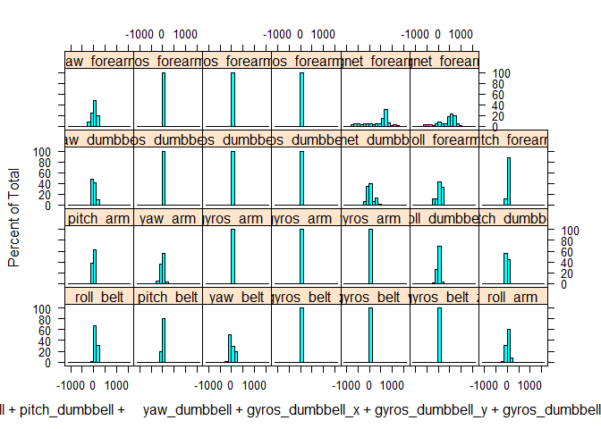
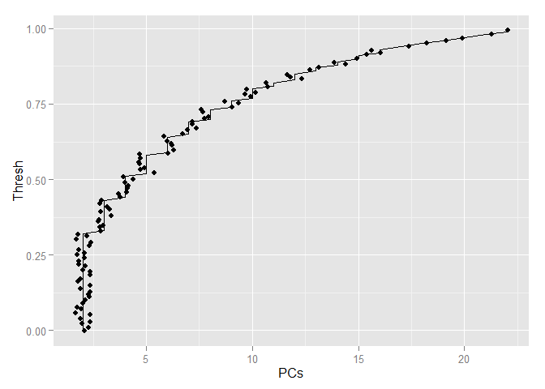

# Course Project - Prediction of Barbell Lifts Using Random Forest Algorithm
Pietro Franzero  

      
## Overview
     
In this article, I built a model to predict the way in which a set of individuals performed barbell lifts based on a set of data. After pre-processing the data, I employed PCA for variable reduction and used random forest to build the predictive model. The result obtained has a 0.11% estimated OOB error rate.
      
## Loading Data
    
Before I begin, I will set echo to TRUE to make the code easier to follow:
    

```r
    opts_chunk$set(echo = TRUE, results = "markup")
```
    
The first step is to load the data and have a look at its structure:
    

```r
    url_train <- "https://d396qusza40orc.cloudfront.net/predmachlearn/pml-training.csv"
    url_test <- "https://d396qusza40orc.cloudfront.net/predmachlearn/pml-testing.csv"
    training <- read.csv(url_train)
    testing <- read.csv(url_test)
    str(training)
```
    
There are 19622 observations and 160 variables. However, since we cannot make inferences on missing predictors, I have removed variables with almost all observations coded as NA:
    

```r
    na_count <- data.frame(variable = names(training), na_count = sapply(training, function(y) sum(length(which(is.na(y))))), row.names = NULL)
    na_count
    names_na <- na_count[which(na_count$na_count!=0),]$variable
    
    training_new <- training[,-which(names(training) %in% names_na)]
```
    
In addition, many variables had either blank values or "#DIV/0!", which have been also removed from the dataset: 
    

```r
    not_num_count <- data.frame(variable = names(training_new), not_num_count = sapply(training_new, function(y) sum(length(which(as.character(y) %in% c("","#DIV/0!"))))), row.names = NULL)
    not_num_count
    names_not_num <- not_num_count[which(not_num_count$not_num_count!=0),]$variable
    
    training_new <- training_new[,-which(names(training_new) %in% names_not_num)]
```
    
Lastly, there is an index (X) and a date variable that are not useful either:
    

```r
    training_new <- training_new[,-1][,-4]
    str(training_new)
```
    
Now, we have 19622 observations and 58 variables.
      
## Model Building Procedure
    
In this article, our objective is to predict the way a set of barbell lifts will be performed based on a set of variables. To accomplish so, I chose to use a random forest algorithm. 
    
Since random forest algorithms are built upon the concept of bagging, [cross-validation is already performed within model-building](http://www.stat.berkeley.edu/~breiman/RandomForests/cc_home.htm#ooberr), and we can get an unbiased estimate of accuracy during the run. In addition, random forests are [less likely to overfit the data](https://en.wikipedia.org/wiki/Random_forest), therefore having better generalization properties. 
    
The random forest is built by partitioning the training data into subsets and calculating a decision tree for each subset. After that, the models are averaged to avoid overfitting and reduce the bias specific to each of the trees.
    
First, we should check whether any transformation in variables is necessary. To do so, I plotted histograms for each of the numeric variables:
    

```r
    training_numeric <- training_new[,which(sapply(training_new,class)=="numeric")]
    
    library(lattice)
    histogram( ~ roll_belt + pitch_belt + yaw_belt + gyros_belt_x + gyros_belt_y + gyros_belt_z + roll_arm + pitch_arm + yaw_arm + gyros_arm_x + gyros_arm_y + gyros_arm_z  + roll_dumbbell + pitch_dumbbell + yaw_dumbbell + gyros_dumbbell_x + gyros_dumbbell_y + gyros_dumbbell_z + magnet_dumbbell_z + roll_forearm + pitch_forearm + yaw_forearm + gyros_forearm_x + gyros_forearm_y + gyros_forearm_z + magnet_forearm_y + magnet_forearm_z, data = training_numeric) 
```

 
    
All variables seem to follow somewhat Gaussian distributions, so I did not judge any transformation to be necessary.
    
Although I reduced the numbers of variables from 160 to 58, there is still excessive predictors. Therefore, I performed a principal component analysis (PCA) in the numeric variables to reduce the number of variables. In order to determine the optimal threshold, I plotted a graph of variance vs PCs:
    

```r
    library(caret)
```

```
## Loading required package: ggplot2
```

```r
    thresh_levels <- data.frame(matrix(nrow=0,ncol=0))
    for(i in seq(0,0.99,by=0.01)){
      preProc <- preProcess(training_numeric, method = "pca", thresh = i)
      thresh_levels <- rbind(thresh_levels,c(i,ncol(preProc$rotation)))
    }
    names(thresh_levels) <- c("Thresh","PCs")
    
    library(ggplot2)
    qplot(x = PCs, y = Thresh, data = thresh_levels, geom = c("jitter","line"))
```

 
    
From the graph, we can see that the optimal point is somewhere around 15 PCs - a reduction of 12 variables from the original 27 numeric variables. This means a threshold of 91%. Now we can proceed with the PCA:
    

```r
    library(caret)
    
    preProc <- preProcess(training_numeric, method = "pca", thresh = 0.91)
    
    training_PC <- predict(preProc,training_numeric)
    
    training_full <- cbind(training_new[,which(sapply(training_new,class)!="numeric")],training_PC)
```
    
To perform the random forest algorithm, I used dataframes instead of the usual formula notation [to make the model faster](http://stats.stackexchange.com/questions/37370/random-forest-computing-time-in-r) and set _ntree_ to 500:
    

```r
    library(caret)
    library(randomForest)
    set.seed(290893)
    training_class <- training_full[,31]
    training_full <- training_full[,-31]
    RandFor <- randomForest(y = training_class, x = training_full, ntree = 500)
    RandFor
```

```
## 
## Call:
##  randomForest(x = training_full, y = training_class, ntree = 500) 
##                Type of random forest: classification
##                      Number of trees: 500
## No. of variables tried at each split: 6
## 
##         OOB estimate of  error rate: 0.11%
## Confusion matrix:
##      A    B    C    D    E  class.error
## A 5580    0    0    0    0 0.0000000000
## B    1 3796    0    0    0 0.0002633658
## C    0    7 3415    0    0 0.0020455874
## D    0    0    8 3205    3 0.0034203980
## E    0    0    0    2 3605 0.0005544774
```
    
After running the model, we can plot confusion matrices to check the accuracy in the training set:
    

```r
    library(caret)
    conf_training <- confusionMatrix(training_new$classe,predict(RandFor,training_full))
    conf_training
```

```
## Confusion Matrix and Statistics
## 
##           Reference
## Prediction    A    B    C    D    E
##          A 5580    0    0    0    0
##          B    0 3797    0    0    0
##          C    0    0 3422    0    0
##          D    0    0    0 3216    0
##          E    0    0    0    0 3607
## 
## Overall Statistics
##                                      
##                Accuracy : 1          
##                  95% CI : (0.9998, 1)
##     No Information Rate : 0.2844     
##     P-Value [Acc > NIR] : < 2.2e-16  
##                                      
##                   Kappa : 1          
##  Mcnemar's Test P-Value : NA         
## 
## Statistics by Class:
## 
##                      Class: A Class: B Class: C Class: D Class: E
## Sensitivity            1.0000   1.0000   1.0000   1.0000   1.0000
## Specificity            1.0000   1.0000   1.0000   1.0000   1.0000
## Pos Pred Value         1.0000   1.0000   1.0000   1.0000   1.0000
## Neg Pred Value         1.0000   1.0000   1.0000   1.0000   1.0000
## Prevalence             0.2844   0.1935   0.1744   0.1639   0.1838
## Detection Rate         0.2844   0.1935   0.1744   0.1639   0.1838
## Detection Prevalence   0.2844   0.1935   0.1744   0.1639   0.1838
## Balanced Accuracy      1.0000   1.0000   1.0000   1.0000   1.0000
```
    
I obtained fairly high levels of accuracy in the training set and an estimated 0.11% OOB error rate, which suggests a great generalization power.
      
### Conclusion
    
Finally, we can make the prediction for the testing set:
   

```r
    library(caret)
    
    testing_new <- testing[,-160]
    testing_new <- testing_new[,names(training_full)[1:30]]
    testing_numeric <- testing[,names(training_numeric)]
    testing_PC <- predict(preProc,testing_numeric)
    testing_full <- cbind(testing_new,testing_PC)
    levels(testing_full$new_window) <- levels(training_full$new_window)
    
    prediction <- predict(RandFor,testing_full)
    prediction
```

```
##  1  2  3  4  5  6  7  8  9 10 11 12 13 14 15 16 17 18 19 20 
##  B  A  B  A  A  E  D  B  A  A  B  C  B  A  E  E  A  B  B  B 
## Levels: A B C D E
```
      
